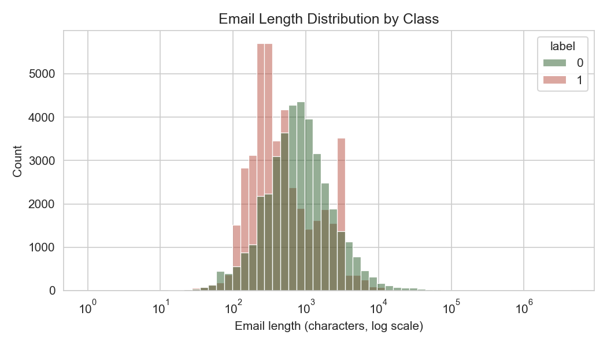
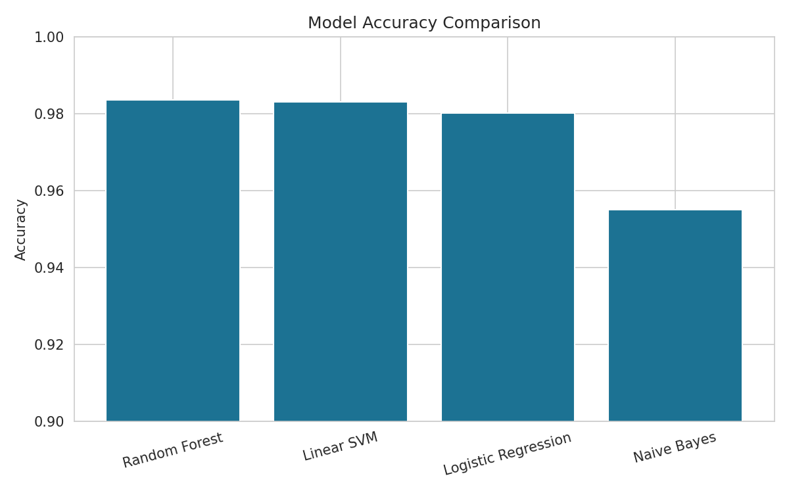

# 🎣 AI Phishing Email Detection Model

<div align="center">

[](https://github.com/Utsav-Saha/AI_Phishing_Email_Detection_Model/stargazers)

[](https://github.com/Utsav-Saha/AI_Phishing_Email_Detection_Model/network)

[](https://github.com/Utsav-Saha/AI_Phishing_Email_Detection_Model/issues)

[](LICENSE) <!-- TODO: Add LICENSE file -->

**An Artificial Intelligence model to effectively detect and classify phishing emails.**

</div>

## 📖 Overview

This project presents an Artificial Intelligence model designed to identify and classify phishing emails. Phishing remains a significant cybersecurity threat, and this model aims to enhance detection capabilities through machine learning techniques. By leveraging natural language processing (NLP) and various classification algorithms, the model analyzes email content to distinguish legitimate messages from malicious phishing attempts. The repository provides the dataset, Jupyter notebooks for the entire ML pipeline (from data exploration to model evaluation), and a structured approach to developing robust email security solutions.

## ✨ Features

-   **Data Loading & Preprocessing**: Efficient loading and cleaning of email datasets, including handling missing values and text normalization.
-   **Natural Language Processing (NLP)**: Utilizes NLTK for text tokenization, stemming/lemmatization, and feature extraction from email bodies.
-   **Feature Engineering**: Creation of relevant features such as TF-IDF vectors, word counts, character counts, and presence of suspicious keywords.
-   **Machine Learning Model Training**: Implementation and training of various classification models (e.g., Logistic Regression, Support Vector Machines, Naive Bayes, Random Forests) using `scikit-learn`.
-   **Model Evaluation**: Comprehensive assessment of model performance using metrics like accuracy, precision, recall, F1-score, and ROC curves.
-   **Exploratory Data Analysis (EDA)**: In-depth analysis and visualization of email data patterns using `matplotlib` and `seaborn` to understand characteristics of phishing emails.
-   **Interactive Workflow**: Jupyter notebooks provide an interactive environment for step-by-step analysis, experimentation, and model development.

## 🖥️ Screenshots

<!-- TODO: Add actual screenshots of key visualizations, model performance reports, or notebook outputs. -->





## 🛠️ Tech Stack

**Language:**

[](https://www.python.org/)

**Libraries:**

[](https://pandas.pydata.org/)

[](https://numpy.org/)

[](https://scikit-learn.org/)

[](https://www.nltk.org/)

[](https://matplotlib.org/)

[](https://seaborn.pydata.org/)

[](https://jupyter.org/)

## 🚀 Quick Start

### Prerequisites
-   Python 3.x
-   `pip` (Python package installer)

### Installation

1.  **Clone the repository**
    ```bash
    git clone https://github.com/Utsav-Saha/AI_Phishing_Email_Detection_Model.git
    cd AI_Phishing_Email_Detection_Model
    ```

2.  **Install dependencies**
    ```bash
    pip install -r requirements.txt
    ```

### Running the Analysis

1.  **Start Jupyter Notebook server**
    ```bash
    jupyter notebook
    ```

2.  **Navigate and open notebooks**
    Your browser will open to the Jupyter dashboard. Navigate into the `notebooks/` directory and open the `.ipynb` files to explore the data, train models, and view evaluations.

## 📁 Project Structure

```
AI_Phishing_Email_Detection_Model/
├── notebooks/                     # Jupyter notebooks for data analysis, model training, and evaluation
│   └── [e.g., Phishing_Detection_EDA_Model.ipynb] # Contains the primary ML workflow
├── dataset_phishing.csv           # Raw dataset used for training and testing the model
├── reports/                       # Directory for generated model reports, plots, and visualizations
├── requirements.txt               # Python dependencies for the project
└── README.md                      # Project overview and setup instructions
```

## ⚙️ Configuration

Model parameters, hyperparameters for algorithms (e.g., number of estimators for Random Forest, regularization strength for Logistic Regression), and other experimental settings are typically configured directly within the Jupyter notebooks. Review the notebook cells for specific configuration details.

## 🔧 Development

### Development Workflow
The development workflow primarily revolves around the Jupyter notebooks.
1.  **Explore Data**: Start with notebooks focusing on EDA to understand the dataset.
2.  **Preprocess & Feature Engineer**: Implement data cleaning and feature extraction steps within the notebooks.
3.  **Train Models**: Experiment with different machine learning algorithms from `scikit-learn`.
4.  **Evaluate & Iterate**: Assess model performance, adjust parameters, and iterate on the model development.

### Extending the Model
-   To incorporate new features, modify the feature engineering sections in the notebooks.
-   To experiment with different models, import and utilize new classifiers from `scikit-learn` or other ML libraries.
-   For deep learning approaches, you might integrate libraries like TensorFlow or PyTorch and corresponding preprocessing steps.

## 🧪 Testing

The "testing" phase in this project refers to the evaluation of the machine learning model's performance. This is typically done within the Jupyter notebooks after training.

**Evaluation Metrics**:
-   **Accuracy**: Overall correctness of the model.
-   **Precision**: Proportion of correctly identified positive cases among all positive predictions.
-   **Recall (Sensitivity)**: Proportion of correctly identified positive cases among all actual positive cases.
-   **F1-Score**: Harmonic mean of precision and recall.
-   **Confusion Matrix**: Visual representation of classification performance.
-   **ROC Curve & AUC**: Measures the trade-off between true positive rate and false positive rate.

These metrics are calculated using `scikit-learn`'s `metrics` module and visualized with `matplotlib`/`seaborn` within the notebooks.

## 🚀 Deployment

This repository focuses on the development and evaluation of the AI model. Direct "deployment" as a standalone service is not part of this project's scope. However, the trained model (once serialized, e.g., using `pickle` or `joblib`) could be integrated into:

-   A web application (e.g., using Flask or FastAPI)
-   An email filtering service
-   A command-line tool for local email scanning

To deploy, you would typically save the trained model object and use it in a production environment with an API wrapper.

## 📄 License

This project is licensed under the [LICENSE_NAME](LICENSE) - see the LICENSE file for details. <!-- TODO: Add a LICENSE file (e.g., MIT, Apache 2.0) -->

## 🙏 Acknowledgments

-   **pandas**, **numpy**: For efficient data handling.
-   **scikit-learn**: The backbone for machine learning algorithms.
-   **nltk**: Indispensable for natural language processing tasks.
-   **matplotlib**, **seaborn**: For creating insightful data visualizations.
-   **jupyter**: For an excellent interactive development environment.

## 📞 Support & Contact

-   🐛 Issues: [GitHub Issues](https://github.com/Utsav-Saha/AI_Phishing_Email_Detection_Model/issues)

---

<div align="center">

**⭐ Star this repo if you find it helpful!**

Made with ❤️ by [Utsav-Saha](https://github.com/Utsav-Saha)

</div>

